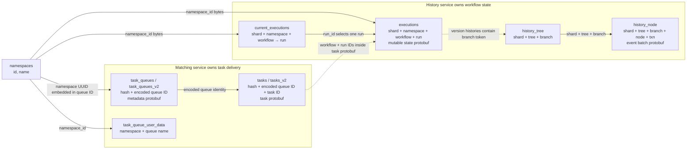

# Who owns the rows, and how they connect

**Primary keys exist. Foreign keys do not.** On the Zinnia `temporal` database, PostgreSQL reports 40 primary-key constraints and zero foreign-key constraints in `public`. A primary key prevents two rows with the same key within one table. It does not tell PostgreSQL that a row in another table must exist. Temporal's services maintain those cross-table relationships through IDs and serialized protobuf fields.

Solid arrows represent matching SQL columns or deterministic ID encoding. Dotted arrows require protobuf decoding. **None is enforced by a PostgreSQL foreign key.** The diagram groups tables by the service responsible for their behavior, not by separate databases: History and Matching both use the Temporal core persistence store.

| Resource | Logical identity / physical key | Relationship and owner |
| --- | --- | --- |
| Namespace | `namespaces.id` is a 16-byte UUID; PK is `(partition_id, id)`; `name` is unique | Shared namespace metadata. Other tables use the UUID bytes, usually as `namespace_id`. |
| Workflow identity | `(namespace_id, workflow_id)` | A name inside a namespace. History assigns it to a shard. |
| Current execution pointer | PK `(shard_id, namespace_id, workflow_id)` | History stores the selected `run_id` in `current_executions`. It can refer to a completed run. |
| Execution run | PK `(shard_id, namespace_id, workflow_id, run_id)` | History stores mutable state in `executions.data` and `executions.state`. A new run has a new `run_id`. |
| History branch | PK `(shard_id, tree_id, branch_id)` | History stores branch metadata in `history_tree`. An execution's `version_histories` protobuf contains branch tokens with tree/branch IDs. Forked branches can refer to ancestor branches. |
| History event batch | PK `(shard_id, tree_id, branch_id, node_id, txn_id)` | History appends protobuf event batches to `history_node`; `node_id` is the batch's first event ID. No workflow ID column exists here. |
| Matching queue | PK `(range_hash, task_queue_id)` in both `task_queues` and `task_queues_v2` | Matching owns queue metadata. The encoded ID contains namespace UUID + physical queue name + task type; partitions have distinct names. |
| Matching task | PK `(range_hash, task_queue_id, task_id)` in `tasks`; `(range_hash, task_queue_id, pass, task_id)` in `tasks_v2` | Matching holds a task until it is delivered or removed. Its `AllocatedTaskInfo` protobuf contains namespace/workflow/run IDs. A v2 task ID can include a subqueue suffix. |
| Task queue user data | PK `(namespace_id, task_queue_name)` | Matching manages versioning data for a logical queue. It is separate from the short-lived queue metadata and backlog. |

The important shape is **one task queue serves many workflow executions**, while one workflow execution may schedule work onto several queues. Thus there is no simple `executions.task_queue_id` foreign key. History decides that a workflow or activity task is needed; a History transfer task gets it to Matching; Matching delivers it to a polling worker. When the worker receives it, Matching calls History to record that the task started. History remains authoritative for the workflow's durable state and events; Matching is authoritative for queue state and pending delivery.

The [onboarding views](README.md) expose these links with actual rows. Start with `workflow_resource_map` to see a current run, its branch, batch count, and stored Matching task rows in one grid. `history_branch_batches` labels stored batches with workflow/run IDs, and `matching_task_workflows` extracts those IDs from persisted task blobs. `matching_queues` decodes the queue ID into namespace/name/type. Full event contents still require [protobuf decoding](README.md#a-first-history-row).

Source: [PostgreSQL schema](../../schema/postgresql/v12/temporal/schema.sql), [task-queue key encoder](../../common/persistence/sql/task_util.go), [history branch token code](../../common/persistence/history_branch_util.go), [task protobuf](../../api/persistence/v1/tasks.pb.go), [Matching architecture](../../docs/architecture/matching-service.md), and [workflow lifecycle](../../docs/architecture/workflow-lifecycle.md).
